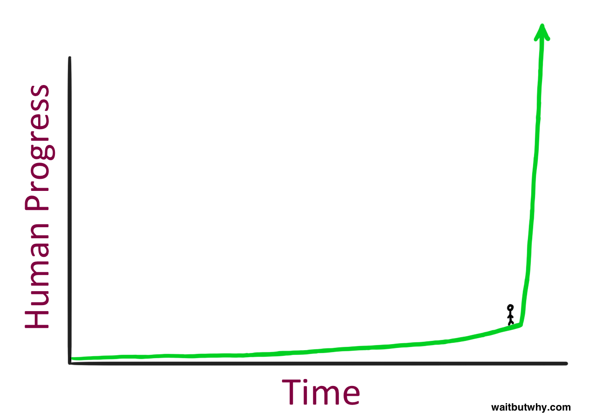

+++
title="2022-01-02"
date=2022-01-02
+++

## How can we build better computational assistants? 

There is a lot of ceremony in note-taking systems. Some examples:

* [Zettelkasten](https://zettelkasten.Heede/posts/overview/)
* [Progressive
  Summarization](https://fortelabs.co/blog/progressive-summarization-a-practical-technique-for-designing-discoverable-notes/)

A lot of the ceremony is due to the need to _maintain_ the system itself. Yes,
there are tools like [Obsidian](https://obsidian.md/) and [Roam
Research](https://roamresearch.com/) that help to maintain these systems, but
they are largely tools that make it more _efficient_ to maintain the system.

Perhaps an interesting thought experiment (I don't have solutions here, I'm
just trying to write down the right questions to ask) would be to imagine what
a Star Trek like conversation with a super-intelligent machine could look
like?

> ME: Hey Jarvis, teach me about super intelligence
> JAVIS: How does it feel like to be standing here?

> JARVIS: {more smart things}

That drawing is from the
[beginning](https://waitbutwhy.com/2015/01/artificial-intelligence-revolution-1.html)
of Tim Urban's excellent 95,000 word magnum opus of a 4-part blog post. I've
been _obsessed_ (over the past hour or so) with Tim's storytelling virtuosity.
What Tim seems to do extremely well is take very complex systems and boil them
down into simple, accessible, yet entertaining stories. As I think about what
a super-intelligent note taking system could be, could it be something that 
could take our boring notes about something and synthesize it into something
incredibly interesting and entertaining like what Tim is capable of creating?
Could we have our own "Tim in a Box"?

I must say that this is just one possible take, but I'm pretty sure that
whatever our future hyper-intelligent assistants will be, it won't look like a
VS Code interface.

Incidentally, this idea came about when I was watching Tim's Google Talk this
morning:

{{ youtube(id="mCzaxZZPmN4")}}