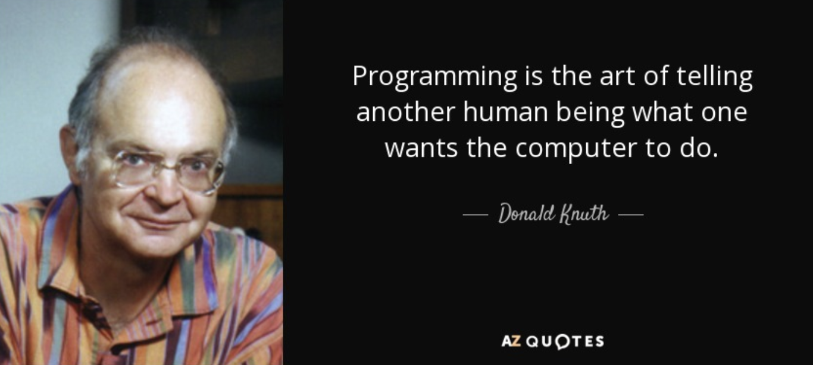
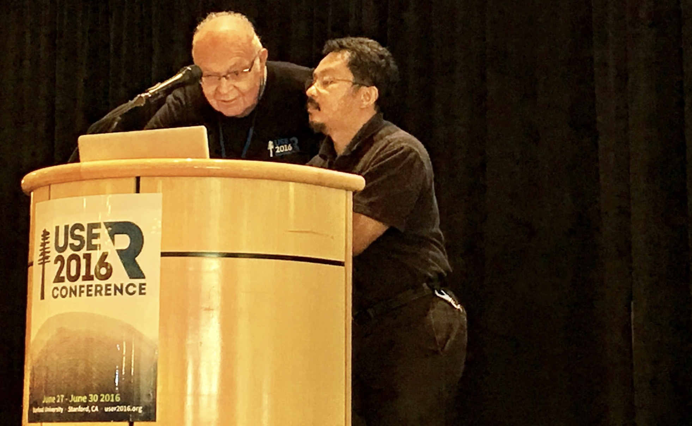

+++
title="2022-01-09"
date=2022-01-09
+++

## Donald Knuth as the patron saint of yak shaving

Once upon a time, there was [Donald
Knuth](https://en.wikipedia.org/wiki/Donald_Knuth). He's a well-known
Professor, Computer Scientist, and Author of
[TAOCP](https://en.wikipedia.org/wiki/The_Art_of_Computer_Programming), his
life's work. Every day he worked on TAOCP as a [digital
recluse](https://www-cs-faculty.stanford.edu/~knuth/email.html). While
progress sometimes slowed down (3 volumes were completed by 1999), he does
have a [schedule](https://www-cs-faculty.stanford.edu/~knuth/taocp.html) for
completing it. 

His work was not un-noticed. TAOCP was named one of the _twelve_ physical
science books of the century in 1999 by American Scientist, alongside other
notable works such as Dirac on quantum mechanics, Einstein on relativity,
Mandelbrot on fractals. And so he kept working until one day in 2015, someone
noticed that there were lots of other things that Knuth created along the way
in support of his life's work. 

The activities that led to the creation of these other things are sometimes
called yak shaving:

> Yak shaving refers to a task, that leads you to perform another related task
> and so on, and so on — all distracting you from your original goal. This is
> sometimes called “going down the rabbit hole.

The first time I heard of this term was at a RubyConf many years ago. Not
surprisingly, Knuth's behavior was noticed by a member of the Ruby community:
[Florian Gilcher](http://skade.me/profile.html) who penned this [wonderful
post](https://yakshav.es/the-patron-saint-of-yakshaves/) on Knuth's yak
shaving activities. Knuth's most notable accomplishment outside of TAOCP is
[TeX](https://en.wikipedia.org/wiki/TeX), a typesetting language that he
invented to typeset TAOCP. So if you consider TeX the original yak shave, it
led to all these other yak shaves that are lovingly chronicled in Florian's
post:

- Write your own programming language to implement TeX in (WEB)
- Invent a new programming paradigm (literate programming - a predecessor to
  today's RMarkdown and Jupyter) for WEB
- Invent a new algorithm for text layout
- Design a font (Computer Modern)
- Invent a new authoring tool for fonts (METAFONT)
- Implement a new device-independent layout engine (DVI)

The [HN post](https://news.ycombinator.com/item?id=29861678) also had this
wonderful comment from [David Fuchs](https://tug.org/interviews/fuchs.html) 
who told a story about _even more yak shaving_ by Knuth(!):

> This and more. The Sail version of TeX is mentioned, but everything else had
> a usable prototype, too: An early version of Metafont in Sail, an early
> version of Web (called Doc, though I don’t recall what the names of the
> Tangle and Weave equivalents were), and an early version of Computer Modern
> fonts in the early Metafont language. Though fully documented and available
> via anonymous FTP on the Arpanet, all of these prototypes were experimental
> proofs-of-concept and were completely discarded, along with the languages
> they implemented, with the “real” versions rewritten from scratch by Knuth
> (each first by hand on legal pads, then typed in and debugged as a whole.)

> And you missed one more obscure but instructive example: To get the
> camera-ready copy for ACP Vol 2, Knuth purchased an Alphatype CRS
> phototypesetter. And, unhappy with the manufacturer’s firmware, he rewrote
> the 8080 code that drives the thing. Eight simultaneous levels of interrupts
> coming from various subsystem: the horizontal and vertical step-motors that
> you had to accelerate just right, while keeping synchronized with four S100
> boards that generated slices of each character in realtime from a
> proprietary outline format, to be flashed into the lens just as it was
> passing the right spot on the photo paper. (Four identical boards, since you
> had to fill the second while the first one did its processing; times two for
> two characters that might overlap due to kerning). Oh, and you had to handle
> memory management of the font character data since there wasn’t enough RAM
> for even one job’s worth (see our joint paper).

> Fun times. I did the driver on the mainframe side, so got to be there for
> the intense debugging sessions that used only the CRS’s 4x4 hex keypad and
> 12-character dot-matrix display.

> Thanks for the DVI shout-out, btw.

I was fortunate enough to meet Knuth at [useR
2016](https://www.r-project.org/conferences/useR-2016/) when it was held on
the campus of Stanford University. At the end of his session on literate
programming, he rode away on a bicycle carrying an enormous stack of books
precariously perched on one hand. Keep in mind he was 77 years old at the
time! Sadly the only photo I have of Knuth from his talk was this one where,
apparently, even the great Donald Knuth needs a bit of help to project from
his computer!

That trip marked the first time that I rode a mountain bike. I couldn't have
picked a better place to do this on the amazing [Arastradero
Preserve](https://en.wikipedia.org/wiki/Arastradero_Preserve):

