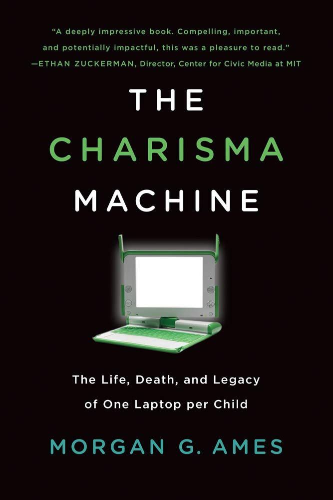

+++
title="2022-01-17"
date=2022-01-17
+++

## The Charisma Machine

[The Charisma Machine by Morgan Ames](https://morganya.org/charisma.html)
chronicles the failure of the One Laptop Per Child project. A telling quote
from the book's website:

> Drawing on a seven-month study of a model OLPC project in Paraguay, this
> book reveals that the laptops were not only frustrating to use, easy to
> break, and hard to repair, they were designed for “technically precocious
> boys”—idealized younger versions of the developers themselves—rather than
> the diverse range of children who might actually use them. 

It's pretty clear that the leaders of the project fell in love with an idea.
One where the solution they were creating matched the problems that the
leaders _personally_ had - a desire for a machine like OLPC when they were
children. They assumed, incorrectly, that all children in developing countries
had the same problem that their solution was designed for. Ames describes
this as _nostalgic design_.

So instead of validating the problem, they went ahead and burned hundreds of
millions of dollars in pursuit of a solution to a problem that apparently did
not exist. Technology is not the solution to all of our problems, especially
in education. But perhaps more interesting for those of us who work in product
development is understanding _why_ Negroponte was wrong? What could he have
done differently in retrospect? Could the many failures encountered in the 
field have been discovered sooner? This quote captures Negroponte's hubris:

> The days of pilot projects are over. When people say, ‘Well, we’d like to do
> three or four thousand in our country to see how it works.’ Screw you. Go to
> the back of the line and someone else will do it, and then when you figure
> out that this works, you can join as well.

Developing and deploying the solution as quickly as possible was clearly the
end-goal here, not understanding the needs of the customer:

> We’ll take tablets and drop them out of helicopters into villages that have
> no electricity and school, then go back a year later and see if the kids can
> read.

Could they have shipped a better product that fit the needs of their customers
if they had only spent some time trying to understand their customers first?
One can only imagine what might have been had they pursued a different path,
guided by the real needs of their customers. A fantastic case study of what
not to do when building a product.